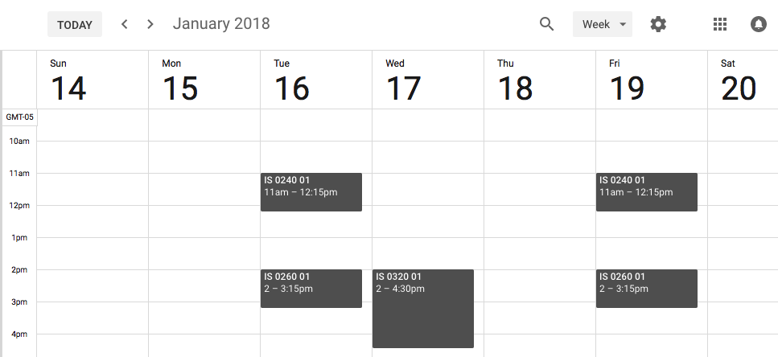

# Course Calendar Generator

This python project generates iCal files for class schedules scraped from Banner.
While the code is designed to scrape Fairfield University course data,
it could be adapted from other schools if needed. Many, many schools use Banner
to administer course scheduling and registration.  

The code is divided into two Python scripts:
* `course_schedule_scraper.py`, which generates JSON-formatted course data based on an HTML dump from Banner Web.
* `calendar_generator.py`, which generates an icalendar (ics) file for each course in the schedule. The calendars are dumped in the `calendars` folder and can be imported into any icalendar-compatible calendaring app (Google Calendar, Apple's iOS and MacOS X apps, etc.). There are 1300+ calendars, each named by course CRN.

The current state of the code is pretty raw and is not intended to be production-ready. Please direct any questions to me at chuntley@fairfield.edu.

## How to try out the calendars
1. Download this repository.  

2. Unzip the repository you downloaded. Usually this just means double-clicking on the file to extract the the zipped files to a folder.   

3. In Google Calendar, create a new empty calendar called 'My Classes'.  

4. Import the calendar events from one or more of the `.ics` files in the `calendars` folder. The import for IS240 (CRN 34644) is shown below.  

5. The classes should now appear on your new class calendar. The schedules take into account school holidays but does not include Final Exams. (Finals will have to be accounted for separately.) The finished calendar with IS240, IS260, and IS320 classes is shown below.  

